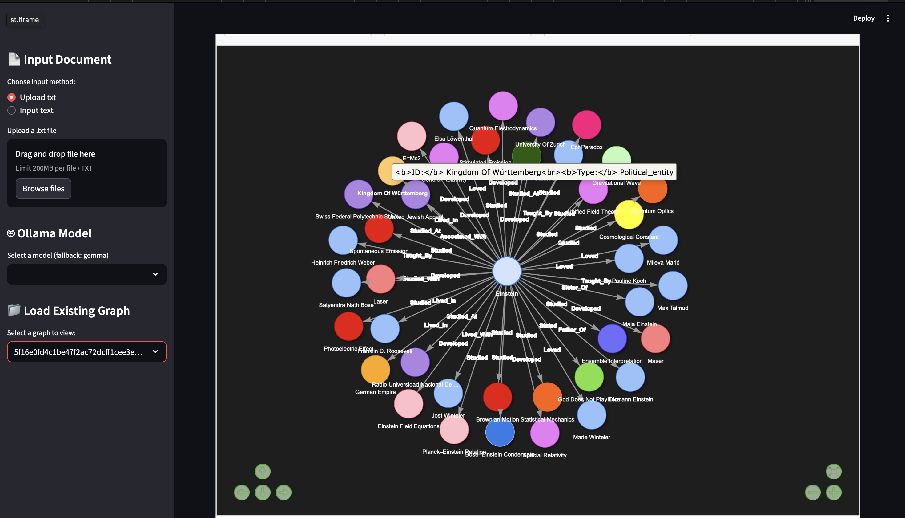
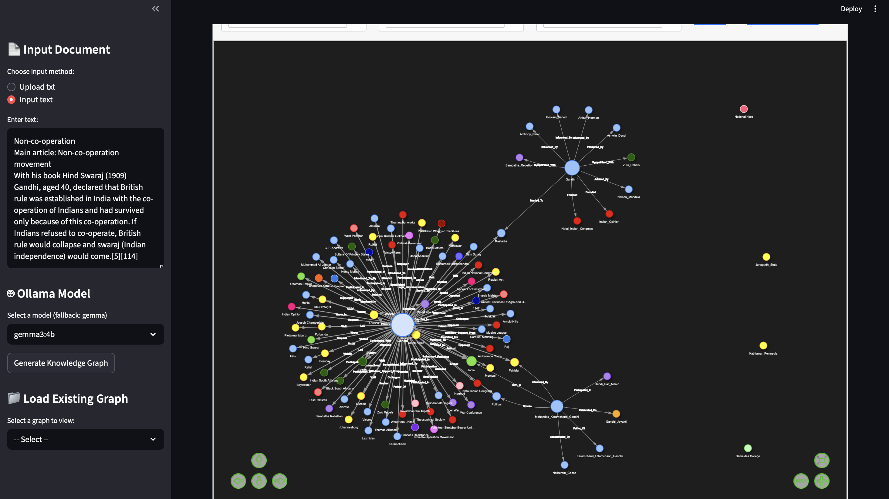

=======
# 🧠 Knowledge Graph From Text

A **Streamlit web app** that generates interactive **knowledge graphs** from plain text using **Ollama AI models**.  
You can upload a `.txt` file or paste text, and the app will create a graph where concepts are visualized as connected nodes.

---

## 📸 Preview


------------------------------------------------------------------

---

## 🚀 Features

- **Two input methods**: Upload `.txt` file or paste text directly.
- **Ollama model integration**: Select from available local models (e.g., Gemma, Mistral, LLaMA).
- **Automatic graph storage**: Generated graphs are saved and can be reloaded anytime.
- **Interactive visualization**: Zoom, drag, and explore relationships between concepts.
- **Optimized for speed**: Uses hashed filenames to prevent regenerating the same graph.

---

## 📂 Project Structure
```
.
├── app.py            # Main Streamlit app 
├── Data              # Folder containing .html files.
├── n_sc.png          # Image file (doc)
├── README.md         # Project documentation and instructions(doc)
├── requirements.txt  # List of Python dependencies for the project(libraries)
├── sc.png            # Another image file (doc)
└── src
    ├── config
    │   └── folder_con.py       # Configuration for folder creation
    ├── graph
    │   ├── generate_kgraph.py  # Script to generate knowledge graphs
    │   └── visulization.py     # Script to visualize knowledge graphs (PyVis)
    ├── model
    │   └── model_info.py       # information about installed Ollama models/context len
    └── utils
        ├── file_op.py          # Utility functions for file operations (read/write)
        └── text_clean.py       # Utility functions for text preprocessing/cleaning
```
---

## ⚙️ Installation

1. **Clone the repository**
```bash
git clone https://github.com/ganeshnikhil/Kgraph.git
cd Kgraph
```

2. **Create a virtual environment**
```bash
python -m venv venv
source venv/bin/activate  # On Linux/Mac
venv\Scripts\activate     # On Windows
```

3. **Install dependencies**
```bash
pip install -r requirements.txt
```

4. **Install Ollama (if not already installed)**  
Follow instructions from: [https://ollama.ai/download](https://ollama.ai/download)

5. **Download a model** (example with Gemma)
```bash
ollama pull gemma3:4b
```

---

## ▶️ Usage

Run the Streamlit app:
```bash
streamlit run app.py
```

Then:
- Upload a `.txt` file **or** paste your text in the sidebar.
- Select an **Ollama model** to use for generating the graph.
- Click **"Generate Knowledge Graph"**.
- View, zoom, and explore the interactive visualization.
- Load previously generated graphs from the sidebar.

---

## 📌 Notes

- All generated graphs are saved in the `Data/` directory as `.html` files.
- Large input text may take more time to process depending on the model.
- If no model is found, the app will fall back to **Gemma**.

---

## 📜 License
This project is licensed under the MIT License — see the [LICENSE](LICENSE) file for details.

